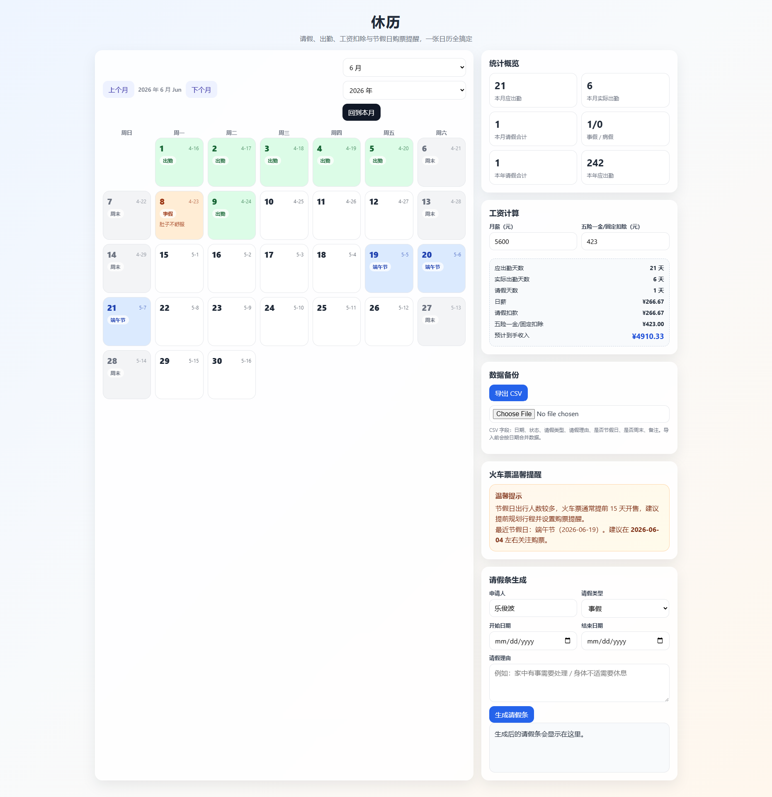
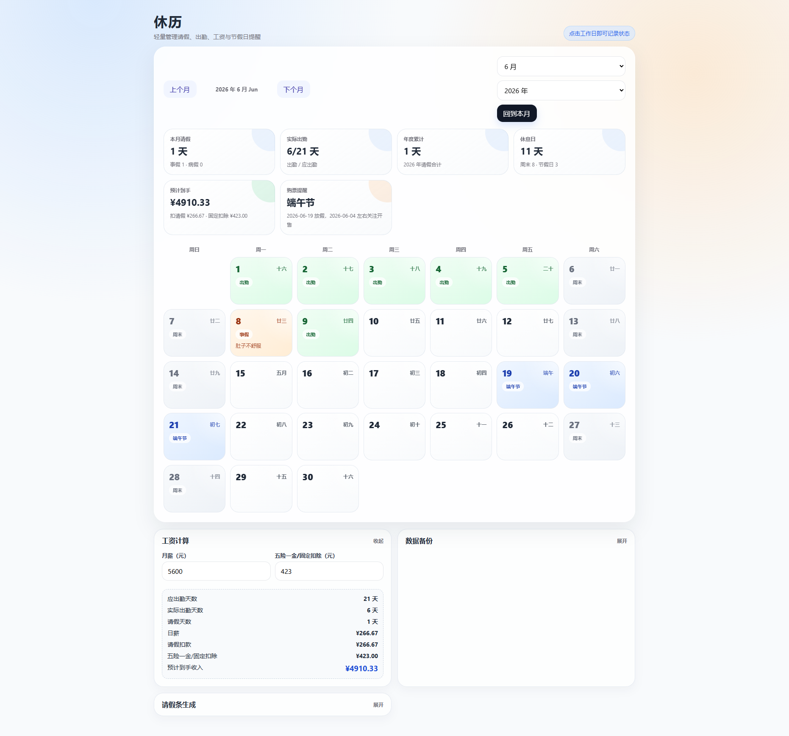

# 写在前面

这是第一次自己想要根据自己正儿八经的需求，来开发一款工具来解决平时经常遇到的类似请假相关问题。

因为是在小公司，所谓的请假流程没用那么完善，通常都只是发个微信跟上级请示一下今天因为啥原因来不了了。

然后这天的薪水也就没了。但是之前刚来的时候还是会写请假条的，因为请假比较频繁，所以后面就不怎么写了，开发这款工具很大原因也是这一点。

想要自动根据日期、原因生成请假条，这样方便以后如果有什么纠纷可以派上用场，然后后面也加上了自己想要的一些功能；

比如根据节假日安排购票提醒；设置年假和调休额度；根据请假和出勤天数计算本月薪水等。

# Vibe Coding

有了这个需求之后我便开始把我的需求列出来，转换成提示词。刚开始的提示词很简陋，基本上就是一两段话，像是boss吩咐给手下的一些大白话；

```

vibecoding一个简单的每月请假天数统计，月历样式，获取每个月的相关数据，包括中国农历的相关数据以及节假日，支持查询每月，每年的请假的天数统计，共计等，支持导入和导出请假的数据为csv（方便备份）。
第二个功能是计算每月出勤天数，周末不算出勤，然后可以根据月薪来计算每次请假扣除的工资，最后计算出月薪的实际收入，还要输入扣除五险一金的钱。
第三个功能是根据节假日来提醒买火车票的时间，一般是提前15天开启购票，可以下方制作一个温馨提示的框来提示用户。
第四个功能是根据请假日期可以输入请假理由来拟写请假条，分为事假和病假，请假模板你来写。
日历上的每一天（除了周末）都是可以点击的，原本是没有颜色的，点击后可以选择出勤或者请假，这样更美观。
```

让Chat优化以后变成为了可执行的一项一项的小要求，最后的提示词如下：

```
    请帮我开发一个简洁美观的 Web 工具，工具名称叫「休历」，用于管理请假、出勤、工资扣除和节假日购票提醒。
    
    整体风格要求：
    界面清爽、直观，采用月历样式作为核心交互。日历中的每一天都以卡片形式展示，默认无特殊颜色；周末自动标记为非出勤日，不计入出勤天数。工作日可以点击，点击后弹出或展开操作菜单，让用户选择「出勤」或「请假」，并支持填写请假类型和请假理由。不同状态使用不同颜色区分，例如出勤、事假、病假、节假日、周末等，让日历更美观易读。
    
    核心功能一：请假天数统计
    
    1. 以月历形式展示每个月的数据。
    2. 每天显示公历日期，并尽量展示中国农历信息。
    3. 自动识别并展示中国法定节假日、调休、周末等信息。
    4. 用户可以按月查看请假天数统计。
    5. 用户可以按年查看请假天数统计。
    6. 支持统计事假、病假、总请假天数、实际出勤天数、节假日天数、周末天数等。
    7. 支持请假数据的 CSV 导入和导出，方便备份和恢复。
    8. CSV 内容应包含：日期、状态、请假类型、请假理由、是否节假日、是否周末、备注等字段。
    
    核心功能二：出勤天数与工资计算
    
    1. 自动计算每月应出勤天数，周末不计入出勤。
    2. 法定节假日不计入应出勤天数。
    3. 用户可以输入月薪。
    4. 用户可以输入每月五险一金或其他固定扣除金额。
    5. 根据当月应出勤天数和请假天数，计算每个工作日对应的日薪。
    6. 根据请假天数计算请假扣款金额。
    7. 最终计算本月实际收入。
    8. 工资计算区域需要清晰展示：
    
      * 月薪
      * 应出勤天数
      * 实际出勤天数
      * 请假天数
      * 日薪
      * 请假扣款
      * 五险一金扣除
      * 实际到手收入
    
    核心功能三：节假日火车票购票提醒
    
    1. 根据中国法定节假日自动计算火车票开售提醒日期。
    2. 默认规则：火车票一般提前 15 天开售。
    3. 在节假日前显示对应的购票提醒日期。
    4. 在页面下方制作一个温馨提示框，样式要醒目但不突兀。
    5. 温馨提示内容示例：
      「温馨提示：节假日出行人数较多，火车票通常提前 15 天开售，建议提前规划行程并设置购票提醒。」
    6. 如果某个节假日即将到来，需要在提示框中展示最近的购票提醒信息。
    
    核心功能四：请假条生成
    
    1. 用户在选择请假日期后，可以填写请假理由。
    2. 支持选择请假类型：事假、病假。
    3. 根据请假类型、请假日期、请假天数和请假理由，自动生成一份请假条。
    4. 请假条需要语气正式、简洁、适合提交给领导或 HR。
    5. 提供两个默认模板：
    
    事假模板：
    尊敬的领导：
    您好！
    因【请假理由】，本人需于【开始日期】至【结束日期】请事假，共【请假天数】天。请假期间我会提前安排好相关工作，确保不影响团队正常进度。
    恳请批准，谢谢！
    
    申请人：【姓名】
    日期：【申请日期】
    
    病假模板：
    尊敬的领导：
    您好！
    因身体不适，需于【开始日期】至【结束日期】请病假，共【请假天数】天。本人会根据实际情况及时同步恢复进度，并尽量减少对工作的影响。
    恳请批准，谢谢！
    
    申请人：【姓名】
    日期：【申请日期】
    
    交互细节要求：
    
    1. 日历上的每个工作日都可以点击。
    2. 点击日期后可以选择：
    
      * 出勤
      * 事假
      * 病假
      * 清除状态
    3. 选择请假后，可以填写请假理由。
    4. 日历颜色建议：
    
      * 默认工作日：白色或浅灰色
      * 出勤：浅绿色
      * 事假：浅橙色
      * 病假：浅红色
      * 周末：浅灰色
      * 法定节假日：浅蓝色
    5. 页面顶部提供月份切换和年份切换。
    6. 页面侧边或下方展示统计面板。
    7. 数据需要保存到本地，刷新页面后不丢失，可使用 localStorage。
    8. CSV 导入时需要校验格式，避免错误数据覆盖已有数据。
    9. 导出 CSV 时文件名建议格式为：休历-请假数据-YYYY-MM-DD.csv。
    
    技术实现建议：
    请使用 HTML、CSS、JavaScript 实现，优先做成单页面应用。代码结构清晰，方便后续扩展。界面需要适配桌面端和移动端。请尽量减少复杂依赖，如果需要使用节假日或农历数据，可以预留数据结构，方便后续补充或更新。
    
    最终请输出完整可运行的代码，并确保包含：
    
    1. 月历视图
    2. 请假与出勤状态选择
    3. 月度和年度统计
    4. 工资扣除计算
    5. CSV 导入导出
    6. 节假日购票提醒
    7. 请假条生成
    8. 本地数据保存
```


总结一句话： **AI真好用！**

后面通过Claude，Codex最终的成品如下：



说实话，第一版能做成这样已经很不错了，但是这个UI看起来AI味太浓了，而且界面看起来也不是我喜欢的极简风格。

后面就是不断的修改，修改，修改，但是感觉AI总是有点Get不到我的点，也有可能是语言障碍吧，后面有几次我用英文和他沟通，效果有所提升，但还是不够。

最后v0的最终版长成了这样，但是觉得确实还可以哦，但是后面就发现了问题......



# 改改改

我觉得这款工具当时最大的问题在于获取不到节假日全部的信息，还有一些类似节气相关的信息，导致信息不全，其他相关功能也就很难完善。

后面想到了是否可以接入一个能获取（中国）节假日相关信息的API呢？

通过调查最后也是选择了Chinese Days的API，感谢作者开源！o7

::github{repo="Homalos/chinese-days"}

后面界面的优化也是从之前的 GPT5.5 切换到了 Claude Fable 5（感谢Any大善人的无私奉献！）

最后的效果呈现还是相当不错的！

::link{url="https://skywalker23241.github.io/restcal/"}

后面顺便构建了PWA，Portable以及可以执行的安装exe，算是比较完善了。

::github{repo="skywalker23241/restcal"}

# 后记

这次的经历让我明白了，虽然AI现在很强，但是也是需要一个掌舵者来操控全局的，不然就会像是headless fly，老是做一些没有用的改动。

另外，做自己喜欢的东西确实是烧token的，我上个月的Codex已经燃尽了，还好有Any的备用，让我成功完成了这个工具！

之后应该还有很多需要改进的地方吧，像是适配多国语言，不同的假期要添加不同的逻辑等。
